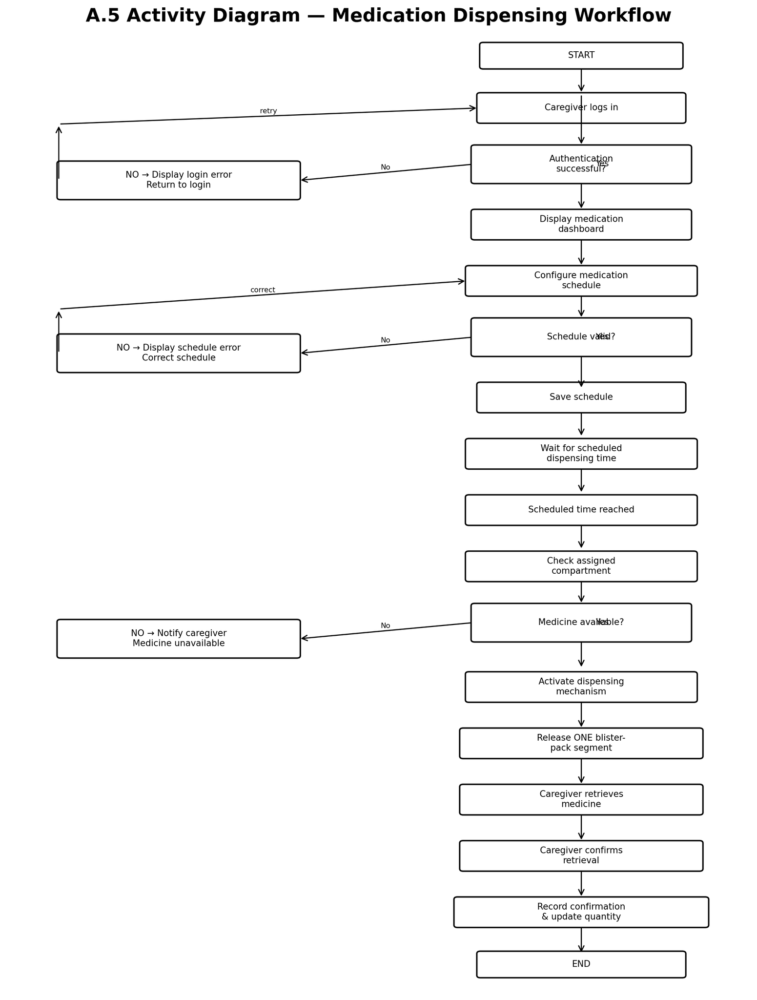

# Activity Diagram

## Design Question

How does the medication-dispensing workflow execute under normal and failure conditions?

## Requirement Mapping

- FR-01 — Caregiver authentication
- FR-02 — Medication scheduling
- FR-03 — Scheduled medication dispensing
- FR-04 — Medication availability monitoring
- FR-05 — Dispensing confirmation
- FR-06 — Dispensing record and quantity update

## Diagram

## Workflow Covered

The activity diagram represents:

1. Caregiver login
2. Authentication
3. Medication dashboard access
4. Medication schedule configuration
5. Schedule validation
6. Saving the schedule
7. Waiting for the scheduled dispensing time
8. Checking the assigned compartment
9. Checking medication availability
10. Activating the dispensing mechanism
11. Releasing one blister-pack segment
12. Caregiver retrieval
13. Caregiver confirmation
14. Recording the confirmation and updating quantity

The diagram also represents error paths for failed authentication, invalid schedules, and unavailable medication.

## Limitations

The diagram focuses on the main medication dispensing workflow and does not model detailed hardware-level operations, communication protocols, or internal database operations.