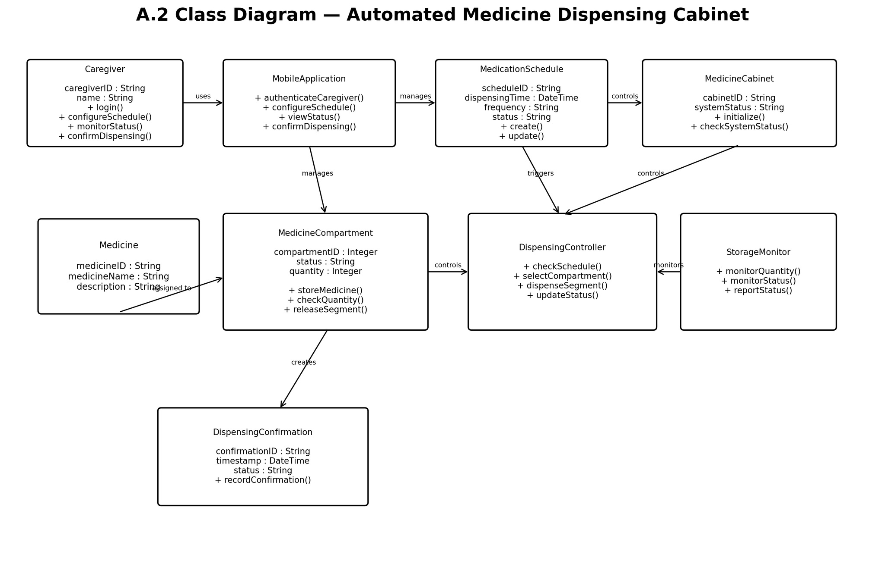

# Class Diagram

## Design Question

What domain concepts, attributes, responsibilities, and associations exist in CareHoMED?

## Requirement Mapping

- FR-01 — Caregiver authentication
- FR-02 — Medication scheduling
- FR-03 — Scheduled medication dispensing
- FR-04 — Medication availability monitoring
- FR-05 — Dispensing confirmation
- FR-06 — Dispensing records

## Diagram

## Major Classes

### Caregiver

Represents the caregiver using the system.

Responsibilities include:

- Login
- Configure medication schedules
- Monitor system status
- Confirm dispensing

### MobileApplication

Provides the caregiver-facing application functions.

Responsibilities include:

- Authenticate caregiver
- Configure schedules
- View status
- Confirm dispensing

### MedicationSchedule

Represents a scheduled medication dispensing event.

Attributes include:

- scheduleID
- dispensingTime
- frequency
- status

### MedicineCabinet

Represents the dispensing cabinet and its overall system status.

### Medicine

Represents an individual medication type.

### MedicineCompartment

Represents a dedicated medication storage compartment.

Responsibilities include:

- Store medicine
- Check quantity
- Release medication segment

### DispensingController

Controls the dispensing process.

Responsibilities include:

- Check schedule
- Select compartment
- Dispense medication segment
- Update status

### StorageMonitor

Monitors medication quantity and storage status.

### DispensingConfirmation

Records caregiver confirmation of medicine retrieval.

## Limitations

The class diagram represents the main logical classes and their relationships. It does not define complete implementation-level attributes, database mappings, hardware interfaces, or all exception-handling classes.