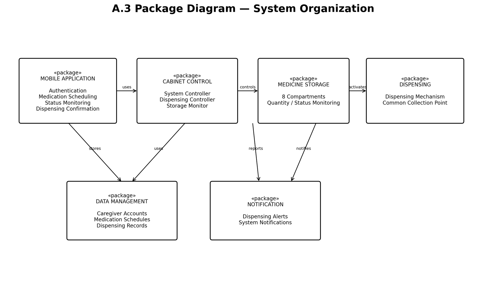

# Package Diagram

## Design Question

How is the CareHoMED codebase organized to enforce architectural boundaries?

## Requirement Mapping

- FR-01 — Caregiver authentication
- FR-02 — Medication scheduling
- FR-03 — Medication dispensing
- FR-04 — Medication storage and quantity monitoring
- FR-05 — Dispensing confirmation
- FR-06 — Dispensing records
- NFR-01 — Reliability
- NFR-02 — Usability
- NFR-03 — Security
- NFR-04 — Maintainability

## Diagram

## Packages

### Mobile Application

Contains:

- Authentication
- Medication Scheduling
- Status Monitoring
- Dispensing Confirmation

### Cabinet Control

Contains:

- System Controller
- Dispensing Controller
- Storage Monitor

### Medicine Storage

Contains:

- Eight Compartments
- Quantity / Status Monitoring

### Dispensing

Contains:

- Dispensing Mechanism
- Common Collection Point

### Data Management

Contains:

- Caregiver Accounts
- Medication Schedules
- Dispensing Records

### Notification

Contains:

- Dispensing Alerts
- System Notifications

## Dependency Relationships

- Mobile Application uses Cabinet Control.
- Cabinet Control controls Medicine Storage.
- Medicine Storage activates Dispensing.
- Mobile Application stores data through Data Management.
- Cabinet Control uses Data Management.
- Medicine Storage reports to Notification.
- Dispensing notifies Notification.

## Limitations

The package diagram presents high-level system organization and dependency relationships. It does not describe individual classes, methods, database schemas, or hardware-level implementation details.