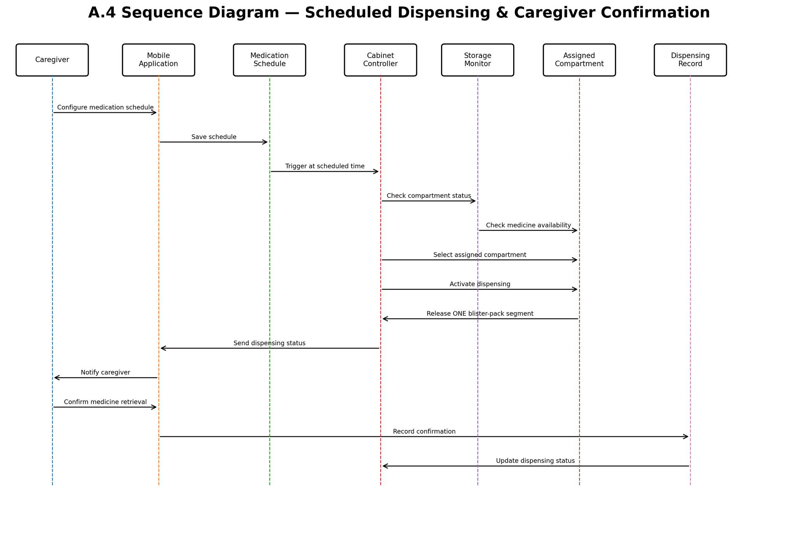

# Sequence Diagram

## Design Question

How do the CareHoMED components collaborate during the critical medication-dispensing scenario?

## Requirement Mapping

- FR-02 — Medication scheduling
- FR-03 — Scheduled medication dispensing
- FR-04 — Medication availability monitoring
- FR-05 — Dispensing confirmation
- FR-06 — Dispensing record update

## Diagram

## Scenario Covered

The sequence begins when the caregiver configures a medication schedule through the mobile application.

The system then:

1. Saves the medication schedule.
2. Triggers the dispensing process at the scheduled time.
3. Checks the compartment status.
4. Checks medication availability.
5. Selects the assigned compartment.
6. Activates dispensing.
7. Releases one blister-pack segment.
8. Sends the dispensing status to the mobile application.
9. Notifies the caregiver.
10. Receives caregiver confirmation of medicine retrieval.
11. Records the confirmation.
12. Updates the dispensing status.

## Limitations

The sequence diagram focuses on the scheduled dispensing and caregiver confirmation scenario. It does not show every possible exception or low-level hardware operation.